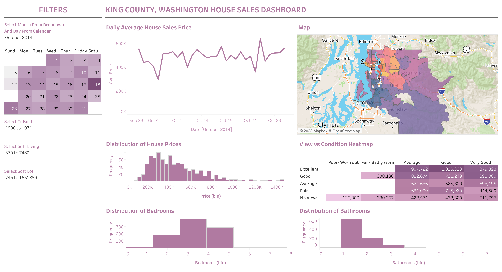

# King-County-House-Sales
This Tableau dashboard offers a glimpse into the King County, Washington House Sales dataset. Utilize this dashboard to delve into different facets of residential property transactions within the King County region, encompassing pricing patterns, property attributes, and geographical spread.

## Tableau Dashboard Preview

# Key Features
` Map View` : The map provides a visual representation of the geographic spread of house sales within King County. You have the flexibility to zoom in or out and interact with individual data points for additional information.

`Price Distribution`: This histogram illustrates the breakdown of house sale prices within the dataset, enabling you to gain insights into the range of prices at which houses were sold.

`Bedrooms vs. Bathrooms`:  Investigate the correlation between the number of bedrooms and bathrooms in homes. This scatter plot serves as a tool for identifying patterns and relationships.

`Year Built`: Observe how the distribution of house sales fluctuates based on the year of construction for the respective properties.

`Property Grade`: This bar chart presents the distribution of property grades assigned to houses featured in the dataset.

## How to Use

To interact with the dashboard, follow these steps:

1. **Access the Dashboard**: [Link to Tableau Dashboard]([link-to-dashboard](https://public.tableau.com/views/KingCountyHouseSales_16954324751590/KingCountyHouseSales?:language=en-US&:display_count=n&:origin=viz_share_link))

2. **Explore the Data**: Use the interactive features within the dashboard to analyze various aspects of house sales in King County.

3. **Customize Your View**: Tailor your view by selecting filters, adjusting parameters, and exploring different visualizations.

## Feedback and Contributions

I welcome feedback, bug reports, and contributions to enhance this project. If you have any suggestions or would like to contribute to the development of this dashboard, please follow these steps:

1. **Fork this Repository**: Click the "Fork" button to create your copy of this repository.

2. **Make Changes**: Make your desired changes or improvements to the dashboard.

3. **Submit a Pull Request**: After making changes in your forked repository, submit a pull request to have your modifications reviewed and merged.

